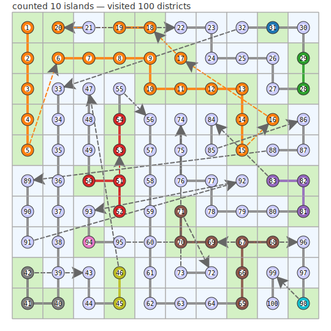

# number-of-islands-hs

This repository contains a small Haskell application (package name `number-of-islands-hs`).


## Introduction

The program implements a classic "number of islands" algorithm on a 2D grid: the input is a xXy matrix of 0/1 values where 1 denotes land and 0 denotes water. The algorithm scans the grid and uses a breadth-first or depth-first traversal to find connected components of land (4-connected: up/down/left/right). Each connected component is counted as an island and marked as visited so it is not recounted.

In main there is an example with 10x10 matrix lands implemetation. Here the graphic exploration path resulting form the algorithm:



- Each visited node displays its visit-order number.
- Different islands are given distinct colors.
- Adjacent visits are connected by a solid colored line; non-adjacent consecutive visits (jumps) are shown as dashed arrows so the trace is easier to follow without drawing misleading long solid connectors.

Complexity: O(R*C) time and O(R*C) extra space (where R and C are the number of rows and columns).

The executable's main behavior is exercised in `app/Main.hs` (the matrix used for the example is defined there) and the test-suite is in `test/MatrixLandsTests.hs`.

## Start a development shell (Nix, using the flake)

The project provides a Nix flake with a development shell that includes Haskell tooling (see `flake.nix`). To start the shell from the project root run:

```bash
# Use the flake's default dev shell (recommended)
nix develop

# Or be explicit about the flake attribute
nix develop .#devShell

# If you want an interactive bash session from the shell
nix develop --command bash
```

Inside that shell you will have access to tools declared in the flake such as `haskell-language-server`, `ghcid`, and `cabal-install`.

## Build and run the application (from the nix shell)

The package defines an executable named `number-of-islands-hs` and a test-suite `matrix-tests` in the `.cabal` file.

Using Cabal (bundled in the dev shell):

```bash
# build the project
cabal v2-build

# run the executable
cabal v2-run exe:number-of-islands-hs

# run the tests
cabal v2-test
```

Using Stack (if you prefer Stack; not required if you use the Nix dev shell):

```bash
stack setup    # only needed the first time
stack build

# run the executable
stack exec number-of-islands-hs

# run the tests
stack test
```

## VS Code tasks

The repository already includes VS Code tasks (see the workspace tasks). Useful ones include:

- `haskell build` → runs `stack build`
- `haskell test` → runs `stack test`
- `haskell watch` → continuous build with `stack build --file-watch`

You can run them from the Command Palette → Run Task... or use the equivalent `stack` commands in a terminal.

## Troubleshooting

- If `nix develop` fails with "flakes are experimental" or unknown option, enable flakes in your Nix configuration or use `nix --experimental-features 'nix-command flakes' develop`.
- If you prefer a reproducible shell for editors, open VS Code with the repository and let the Nix dev shell provide tooling for HLS/formatting.

## Quick checklist

1. From project root: `nix develop` (or `nix develop --command bash`).
2. Inside the shell: `cabal v2-build` and `cabal v2-run exe:number-of-islands-hs` to run.
3. Inside the shell: `cabal v2-test` to run tests.

---

If you'd like, I can also add a short script (e.g. `scripts/run.sh`) to wrap these commands or update `flake.nix` to include `stack` in the dev shell inputs — tell me which you prefer.

## Visualising the traced path

I added a small script that produces an SVG showing the 10x10 grid, land tiles and the visited path:

```bash
python3 scripts/make_path_svg.py
# -> writes visuals/path.svg
```

Open `visuals/path.svg` in your editor or browser to see the path overlay. The script is dependency-free and uses the matrix defined in `app/Main.hs`.

Improvements in the updated script

- Each visited node now shows its visit-order number (labels the nodes 1..N).
- Different islands are colored with different colors (a palette is used and will repeat if there are more islands than colors).
- The script no longer draws long jumps between distant nodes: it only draws connecting segments when two consecutive visits are adjacent (Manhattan distance 1). This avoids misleading long connector lines across the map.

If you need the SVG generated inside the dev shell, make sure Python 3 is available in the shell (you can add it to the `devShell` in `flake.nix` or run the script outside the shell if you have Python installed).
